# Surf's Up - Module 9 Challenge
Chapel Hill - Data Science Bootcamp

## Overview of Project
For Module 9, SQLAlchemy, Pandas, and NumPy were used in conjunction with Jupyter Notebook and SQLite to show temperature trends for Oahu, Hawaii, in June and December. The client wants to open a surf and ice cream shop in the given location, and wants to confirm the potential business' year-long sustainability. Using the SQLite database, summary statistics for the temperatures in June and December were displayed, showing the viability of the proposed shop.

## Method/Results
### D1: June
- Temperatures taken from: 2010 to 2017
- Average temperature: 74.9°F
- Median temperature: 75°F
- Minimum temperature: 64°F
- Maximum temperature: 85°F
- Total number of data points: 1700

June Temperature Summary

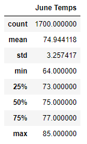

### D2: December
- Temperatures taken from: 2010 to 2016
- Average temperature: 71.0°F
- Median temperature: 71°F
- Minimum temperature: 56°F
- Maximum temperature: 83°F
- Total number of data points: 1517

December Temperature Summary

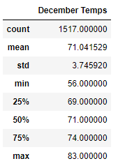

## Summary
From the 1,700 total data points in June from 2010 to 2017, Oahu, Hawaii's temperatures stayed between 64°F and 85°F, with an average of around 75°F. From the 1,517 total data points in December from 2010 to 2016, the area's temperatures remained between 56°F and 83°F, with an average of 71°F. However, it is good to note the data's years; weather patterns and temperatures change, so while past data can show patterns and trends, they may not be an entirely accurate depiction of future weather.

While this level of information is useful in determining whether or not Oahu is a good area to open a surf and ice cream shop, there are several other queries that would be beneficial to prove (or disprove) the location's viability, as shown below.

Note: Each year's data was condensed to create one value per day in each month. All temperature and precipitation datapoints from the same 24-hour period were averaged to create a cohesive dataset.

- Histograms of overall data:
    - Taking the data gathered above, histograms efficiently show where temperatures tend to fall in their respective months.
    
        

        
June

    
        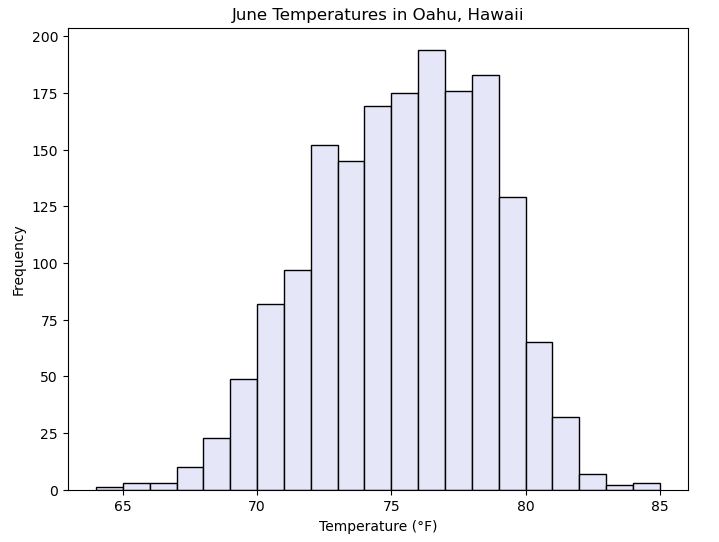
    
        

    
        

        
December

    
        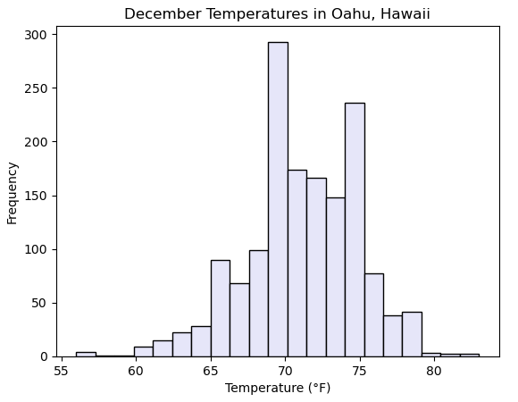
    
        

    
- Viewing yearly temperature trends:
    - By splitting the collected temperatures by year, general trends in temperatures can be seen. Displaying them in both graph and table format allow for easier understanding.
    - Graph:
    
        

        
June

      
        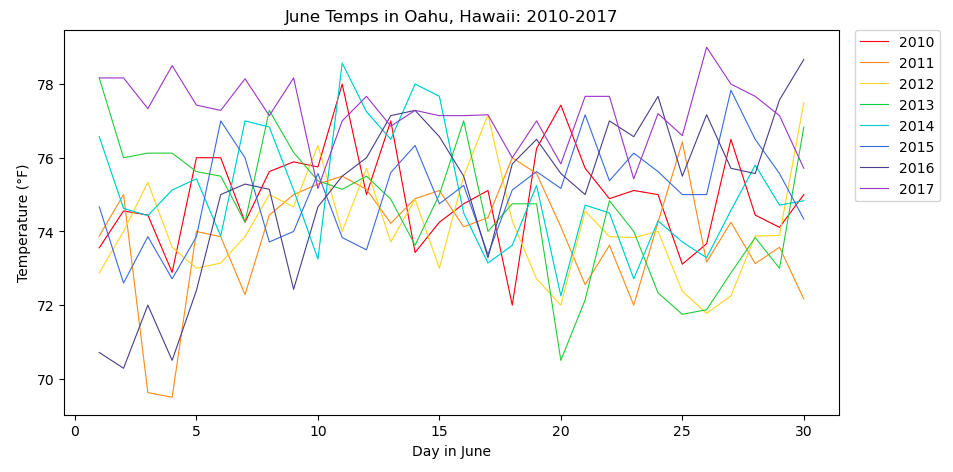
      
        

      
        

        
December

      
        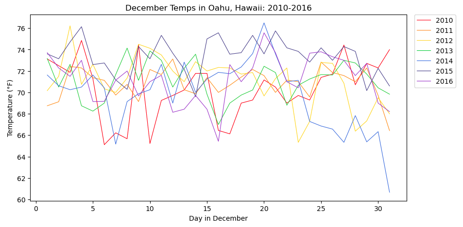
      
        

    
    - Summary:
    
        

        
June

      
        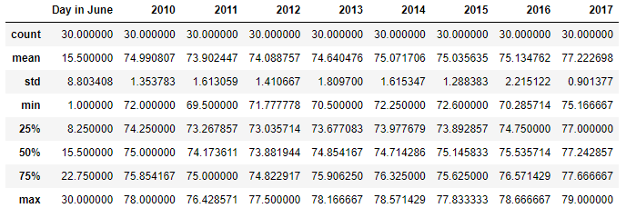
      
        

      
        

        
December

      
        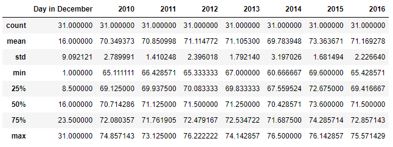
      
        

    
- Precipitation data:
    - Temperature isn't the only useful weather data for determining a location's viability; precipitation also plays a role in consumers' willingness to shop and surf. Querying the same stations, we can gather the precipitation data for June and December and create the same visualizations as for temperature.
    - Histograms:
    
        

        
June

        
        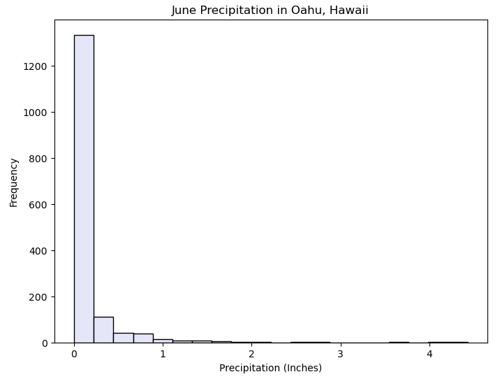
        
        

        
        

        
December

        
        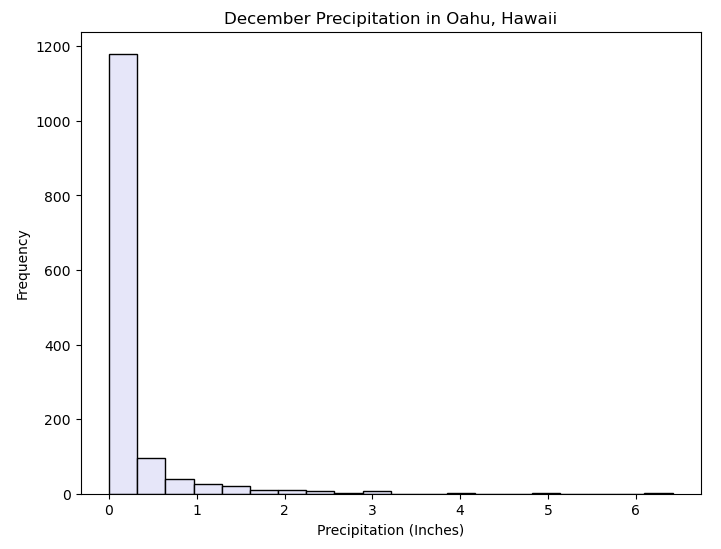
        
        

        
    - Yearly trends:
        - Graph:
        
            

            
June

        
            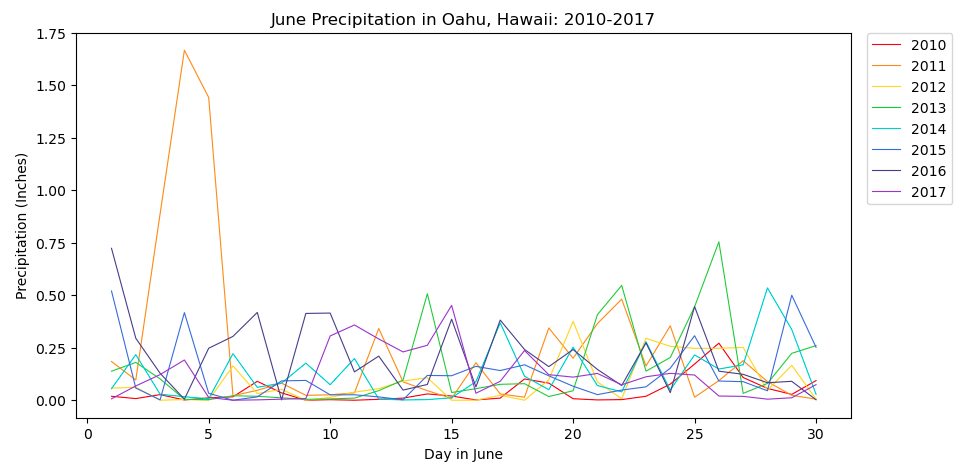
        
            

        
            

            
December

        
            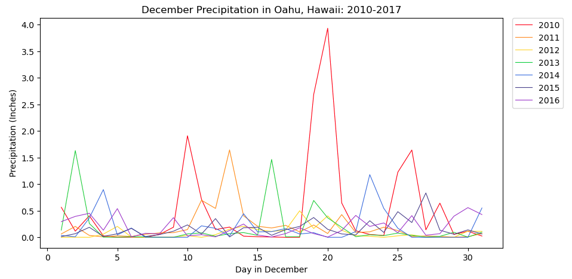
        
            

        
        - Summary:
        
            

            
June

        
            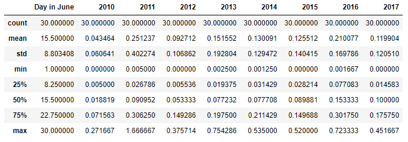
        
            

        
            

            
December

        
            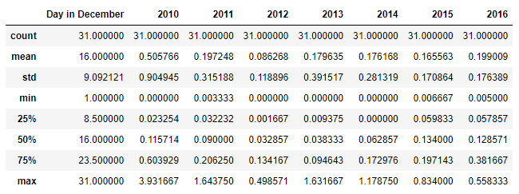
        
            

        
- Querying from most active stations:
    - It's also useful to identify the most active station and plot the data points from that one station to see how a single dataset compares to the whole. This was tested with June temperatures.
    - Histogram comparison:
        
        

        
One Station

        
        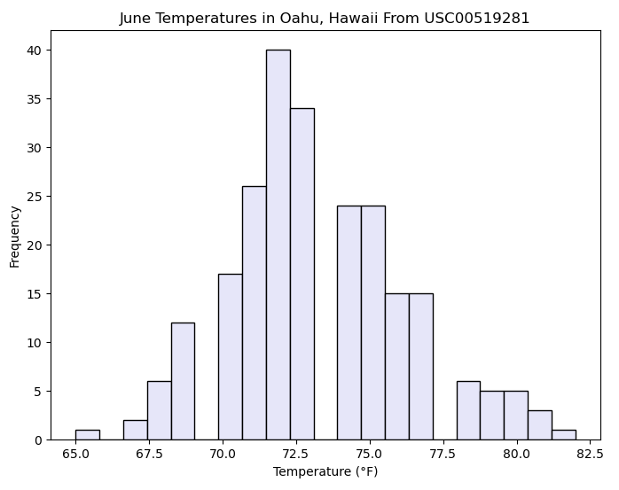
        
        

        
        

        
All Stations

        
        
        
        

        
    - Yearly trends comparison:
        - Graph:
            
            

            
One Station

            
            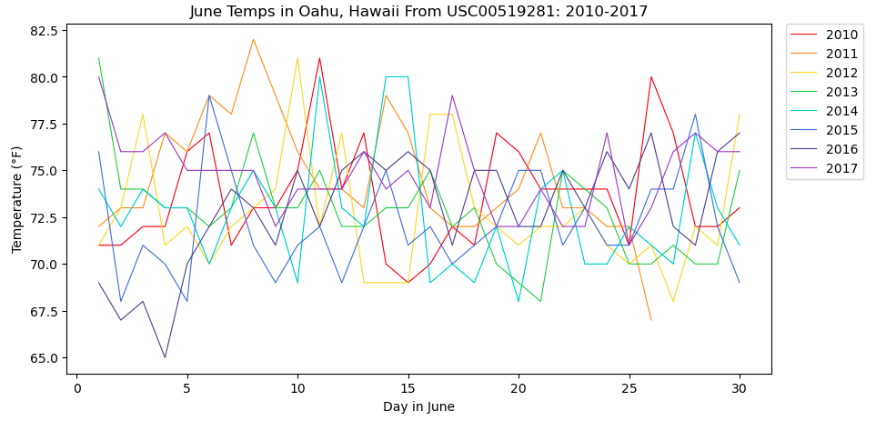
            
            

            
            

            
All Stations

            
            
            
            

            
        - Summary comparison:
            
            

            
One Station

            
            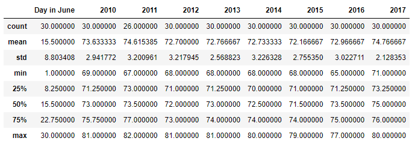
            
            

            
            

            
All Stations

            
            
            
            

NOTE: The work behind visuals displayed in the [Summary] can be found in [SurfsUp_Challenge_Visualizations.ipynb]
